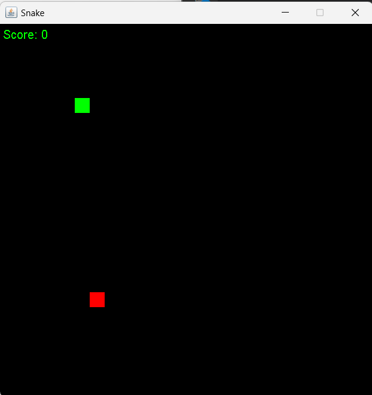

# Snake Game

## Description

This Snake Game project is developed using Java Swing framework and utilizes ArrayList data structure. The game features a classic snake gameplay where the player controls a snake to eat food and grow longer, while avoiding collisions with the walls and itself. The game score is displayed on the screen and the game window has a size of 500x500 pixels.

## Features

Classic snake gameplay
Player-controlled snake movement
Random food generation
Game score display
Collision detection with walls and snake body

## How to Play

1. Use the arrow keys to control the snake's direction: Up, Down, Left, Right.
2. The snake will move continuously in the chosen direction.
3. Eat the food to grow longer and increase your score.
4. Avoid colliding with the walls or the snake's own body, as it will end the game.

## Screenshots

## Installation

1. Clone the repository to your local machine:
   https://github.com/gurukiran32/Snake_Game.git
2. Open the project in your preferred Java IDE.
3. Compile and run the `App.java`` file to start the game.
